# Mermaid MCP App

An MCP App that renders [Mermaid](https://mermaid.js.org/) diagrams as interactive, zoomable UI panels — inline inside Claude, VS Code, and any MCP-compatible client.

## Features

### Diagram Types (13 supported)

#### Flowchart

`flowchart` — General-purpose directed graphs. Supports top-down and left-right layouts, subgraphs, and various node shapes.

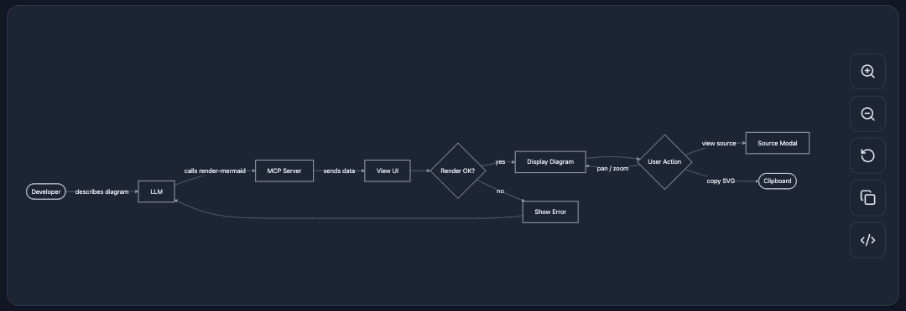

#### Sequence Diagram

`sequenceDiagram` — Interaction between participants over time. Shows messages, loops, and alternative flows.

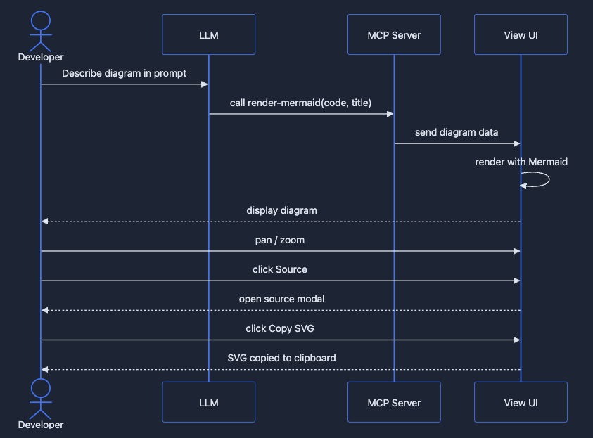

#### Class Diagram

`classDiagram` — Object-oriented class structure with attributes, methods, and relationships (inheritance, composition, etc.).

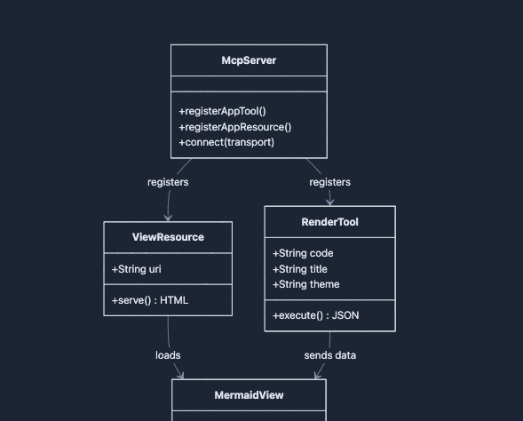

#### State Diagram

`stateDiagram-v2` — Finite state machines with transitions, composite states, and concurrency.

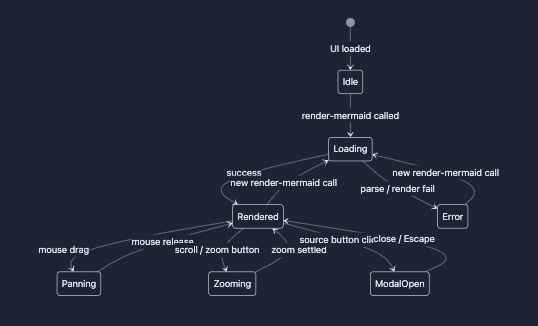

#### ER Diagram

`erDiagram` — Entity-relationship diagrams for data modeling with cardinality annotations.

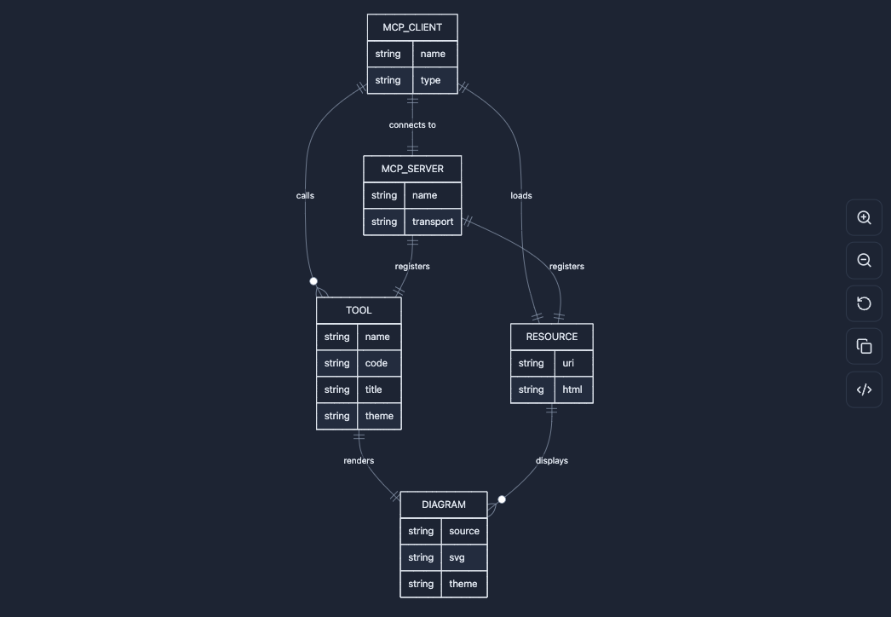

#### Gantt Chart

`gantt` — Project timelines with tasks, milestones, dependencies, and critical paths.

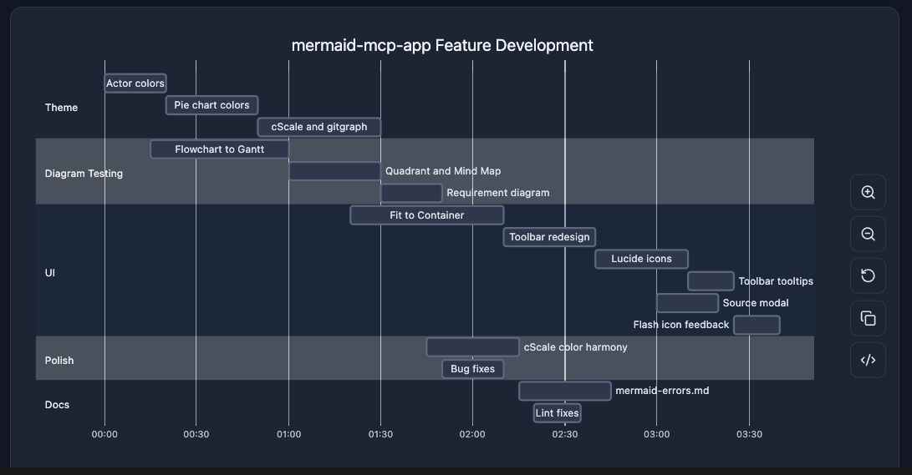

#### Pie Chart

`pie` — Proportional data as pie slices with percentage labels.

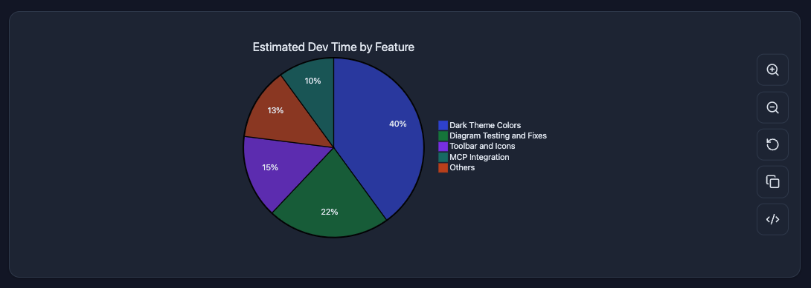

#### Git Graph

`gitGraph` — Git branch and commit history visualization with merge and cherry-pick flows.

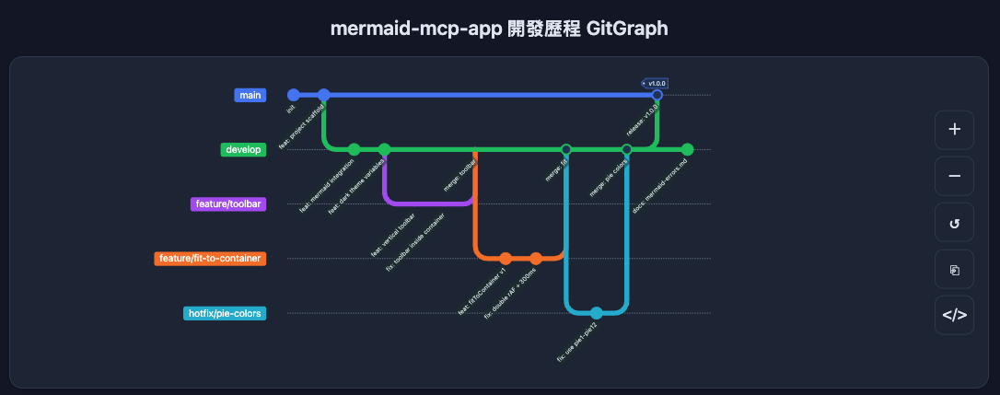

#### Mindmap

`mindmap` — Hierarchical tree of ideas radiating from a central root node.

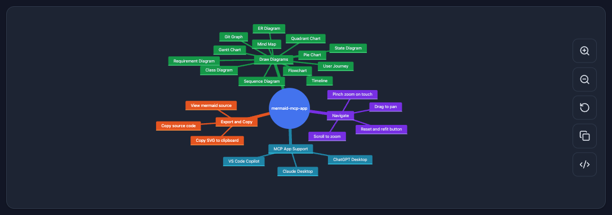

#### Timeline

`timeline` — Chronological events grouped by time period.

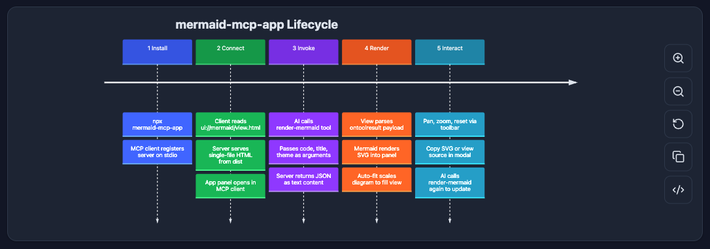

#### User Journey

`journey` — User experience flows scored by satisfaction level across sections and actors.

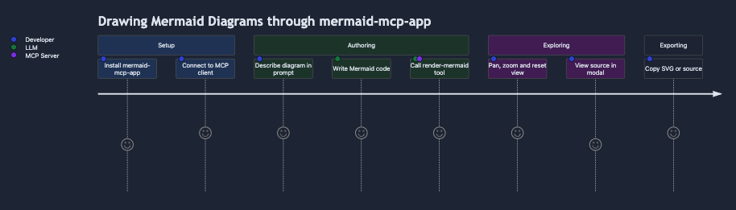

#### Requirement Diagram

`requirementDiagram` — System requirements with type, risk, and verification method, linked to design elements.

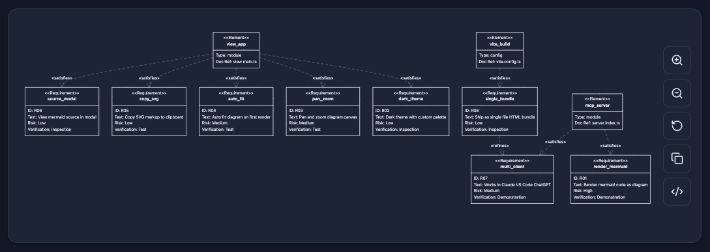

#### Quadrant Chart

`quadrantChart` — Four-quadrant scatter plot for prioritization and positioning analysis.

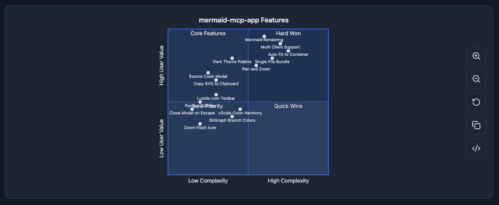

### UI

- **Pan & zoom** — mouse drag to pan, scroll wheel to zoom, pinch-to-zoom on touch
- **Fit to container** — auto-fits diagram on render; reset button restores fit
- **Copy SVG** — copies the rendered SVG to clipboard
- **Source modal** — view and copy the Mermaid source code
- **Toolbar tooltips** — hover labels on all toolbar buttons
- **Theme support** — `dark` (auto-detected from system preference) and `light`

## Installation

> **Requirements:** Node.js >= 20. Older versions of npx (Node 14/16) do not support the `-y` flag and will silently fail. If you use `nvm`, run `nvm alias default 20` and restart your MCP client.

Add to your MCP client configuration:

```json
{
  "mcpServers": {
    "mermaid": {
      "command": "npx",
      "args": ["-y", "mermaid-mcp-app", "--stdio"]
    }
  }
}
```

**Claude Desktop:** `~/Library/Application Support/Claude/claude_desktop_config.json`  
**VS Code:** `.vscode/mcp.json` or user settings

### Local development config

If you are working from a local build instead of the published package, point your MCP client directly at the compiled entry point:

```json
{
  "mcpServers": {
    "mermaid": {
      "command": "node",
      "args": ["/absolute/path/to/mermaid-mcp-app/dist/server/index.js", "--stdio"]
    }
  }
}
```

Using `node` directly avoids any `npx` version issues and does not require the package to be published to npm.

## Usage

Once configured, ask the LLM to draw a diagram:

> "Draw a flowchart showing user authentication flow"

> "Create a sequence diagram for an API request lifecycle"

> "Render this mermaid diagram: `graph TD; A-->B; B-->C`"

You can also specify a theme explicitly:

> "Draw a class diagram with light theme"

## Architecture

```text
┌──────────────────┐     stdio/JSON-RPC     ┌──────────────┐
│   MCP Client     │◄──────────────────────►│  MCP Server  │
│ (Claude/VS Code) │                         │  (index.ts)  │
└────────┬─────────┘                         └──────────────┘
         │                                          │
         │  postMessage                             │ serves dist/view/index.html
         │  (tool-input / tool-result)              │ as ui:// resource
         ▼                                          │
┌──────────────────┐                                │
│  Sandboxed       │◄───────────────────────────────┘
│  iframe          │
│  (Mermaid View)  │
└──────────────────┘
```

The server registers:

1. **`render-mermaid` tool** — accepts `code` (Mermaid syntax), optional `title`, and optional `theme`
2. **`ui://mermaid/view.html` resource** — the bundled single-file HTML with Mermaid.js embedded

## Development

```bash
# Install dependencies
npm install

# Build (view + server)
npm run build

# Watch mode (view only)
npm run dev

# Start server
npm start
```

## Project Structure

```text
mermaid-mcp-app/
├── src/
│   ├── server/
│   │   └── index.ts              # MCP server — registers tool + resource
│   └── view/
│       ├── index.html            # HTML shell
│       ├── style.css             # All UI styles
│       ├── main.ts               # Rendering, pan/zoom, toolbar, MCP App connection
│       ├── dark-theme.const.ts   # Mermaid themeVariables for dark mode
│       └── light-theme.const.ts  # Mermaid themeVariables for light mode
├── dist/
│   ├── server/
│   │   └── index.js              # Compiled server
│   └── view/
│       └── index.html            # Single-file bundled HTML (Vite + vite-plugin-singlefile)
├── vite.config.ts
├── tsconfig.json
└── package.json
```
