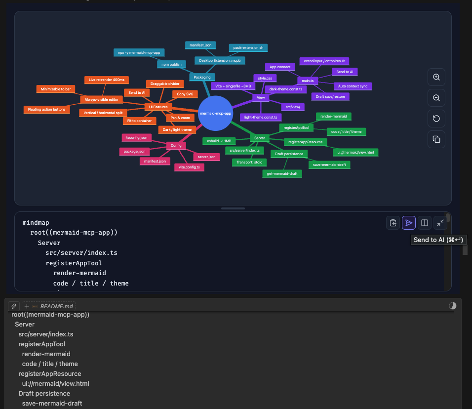

# Mermaid MCP App

An MCP App that renders [Mermaid](https://mermaid.js.org/) diagrams as interactive, zoomable UI panels — inline inside Claude, VS Code, and any MCP-App-compatible client. Edit diagrams directly in the split-view editor and send the updated source back to the LLM to continue the conversation with the latest version.

## Usage

Once configured, ask the LLM to draw a diagram:

```
"Draw a flowchart showing user authentication flow"

"Create a sequence diagram for an API request lifecycle"

"Render this mermaid diagram: `graph TD; A-->B; B-->C`"
```

You can also specify a theme explicitly:

> "Draw a class diagram with light theme"

## Features

### Interaction with AI

Edit the diagram source directly in the split-view editor, then send it back to the LLM to continue the conversation with your changes.



- **Send to AI** — sends the edited diagram source back to the LLM, triggering a response (`⌘↵` / `Ctrl↵`)
- **Auto context sync** — LLM context is automatically updated as you type (debounced); the LLM always sees your latest source on the next message
- **Draft persistence** — editor edits are saved to the server and restored across iframe re-renders

### Diagram Types (13 supported)

#### Flowchart

`flowchart` — General-purpose directed graphs. Supports top-down and left-right layouts, subgraphs, and various node shapes.


#### Sequence Diagram

`sequenceDiagram` — Interaction between participants over time. Shows messages, loops, and alternative flows.


#### Class Diagram

`classDiagram` — Object-oriented class structure with attributes, methods, and relationships (inheritance, composition, etc.).


#### State Diagram

`stateDiagram-v2` — Finite state machines with transitions, composite states, and concurrency.


#### ER Diagram

`erDiagram` — Entity-relationship diagrams for data modeling with cardinality annotations.


#### Gantt Chart

`gantt` — Project timelines with tasks, milestones, dependencies, and critical paths.


#### Pie Chart

`pie` — Proportional data as pie slices with percentage labels.


#### Git Graph

`gitGraph` — Git branch and commit history visualization with merge and cherry-pick flows.


#### Mindmap

`mindmap` — Hierarchical tree of ideas radiating from a central root node.


#### Timeline

`timeline` — Chronological events grouped by time period.


#### User Journey

`journey` — User experience flows scored by satisfaction level across sections and actors.


#### Requirement Diagram

`requirementDiagram` — System requirements with type, risk, and verification method, linked to design elements.


#### Quadrant Chart

`quadrantChart` — Four-quadrant scatter plot for prioritization and positioning analysis.


### UI

- **Pan & zoom** — mouse drag to pan, scroll wheel to zoom, pinch-to-zoom on touch
- **Fit to container** — auto-fits diagram on render; reset button restores fit
- **Copy SVG** — copies the rendered SVG to clipboard
- **Split-view source editor** — always-visible editor panel with live re-render (400ms debounce)
- **Minimizable editor** — collapse to a compact bottom bar; expand with one click
- **Draggable split divider** — resize editor / diagram panels (mouse + touch)
- **Vertical / horizontal layout toggle** — source below (vertical) or to the right (horizontal); minimized state always snaps to the bottom
- **Toolbar tooltips** — hover labels on all toolbar buttons
- **Theme support** — `dark` (auto-detected from system preference) and `light`

## Installation

### Claude Desktop — Extension (recommended)

Download the latest `.mcpb` from [GitHub Releases](https://github.com/finfin/mermaid-mcp-app/releases) and double-click to install. No terminal or configuration needed.

### Claude Desktop — Manual

Add to `~/Library/Application Support/Claude/claude_desktop_config.json`:

```json
{
  "mcpServers": {
    "mermaid": {
      "command": "npx",
      "args": ["-y", "mermaid-mcp-app", "--stdio"]
    }
  }
}
```

### VS Code

Add to `.vscode/mcp.json` or user settings:

```json
{
  "mcpServers": {
    "mermaid": {
      "command": "npx",
      "args": ["-y", "mermaid-mcp-app", "--stdio"]
    }
  }
}
```

## Development

```bash
# Install dependencies
npm install

# Build (view + server)
npm run build

# Watch mode (view only)
npm run dev

# Start server
npm start
```
